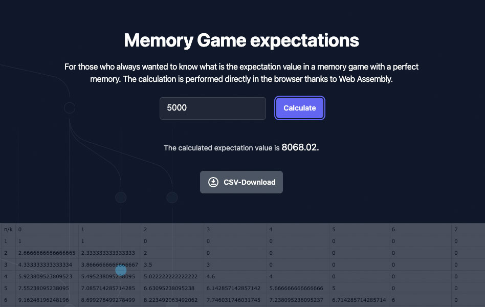

# Memory Game Expectations

A simple app for those who always wanted to know what is the expectation value in a memory game with a perfect memory. The calculation is performed directly in the browser thanks to Web Assembly. The app is written in Rust and uses the [Leptos](https://github.com/leptos-rs/leptos) web framework.

Live demo: [https://memorygame-expectations.shuttleapp.rs/](https://memorygame-expectations.shuttleapp.rs/)



## Getting Started

Start the app with:

```bash
trunk serve
```

## Tailwind

`Trunk.toml` is configured to build the CSS automatically.

You can install Tailwind using `npm`:

```bash
npm install -D tailwindcss
```

If you'd rather not use `npm`, you can install the Tailwind binary [here](https://github.com/tailwindlabs/tailwindcss/releases).

## Setting up with VS Code and Additional Tools

If you're using VS Code, add the following to your `settings.json`

```json
  "emmet.includeLanguages": {
    "rust": "html",
    "*.rs": "html"
  },
  "tailwindCSS.includeLanguages": {
      "rust": "html",
      "*.rs": "html"
  },
  "files.associations": {
      "*.rs": "rust"
  },
  "editor.quickSuggestions": {
    "other": "on",
    "comments": "on",
    "strings": true
  },
  "css.validate": false,
```

Install [Tailwind CSS Intellisense](https://marketplace.visualstudio.com/items?itemName=bradlc.vscode-tailwindcss).

Install [VS Browser](https://marketplace.visualstudio.com/items?itemName=Phu1237.vs-browser) extension (allows you to open a browser at the right window).

Allow vscode Ports forward: 3000, 3001.